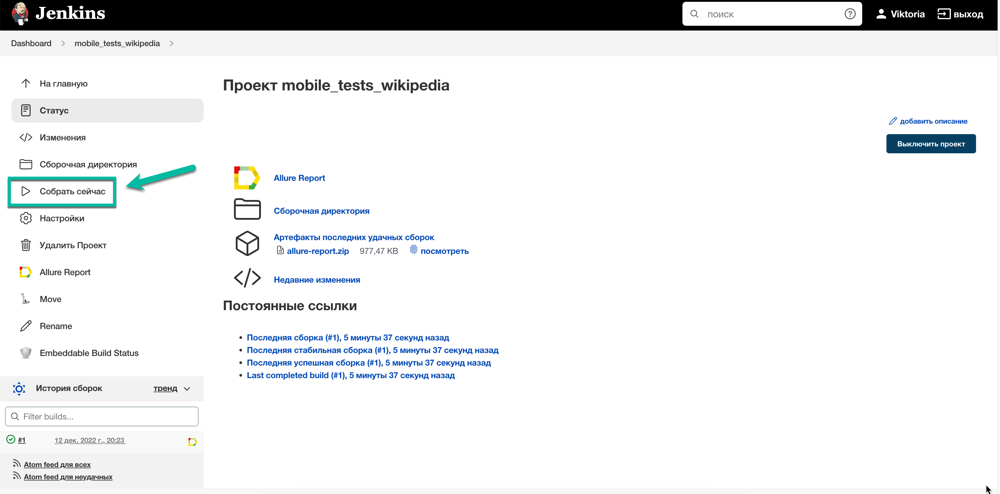
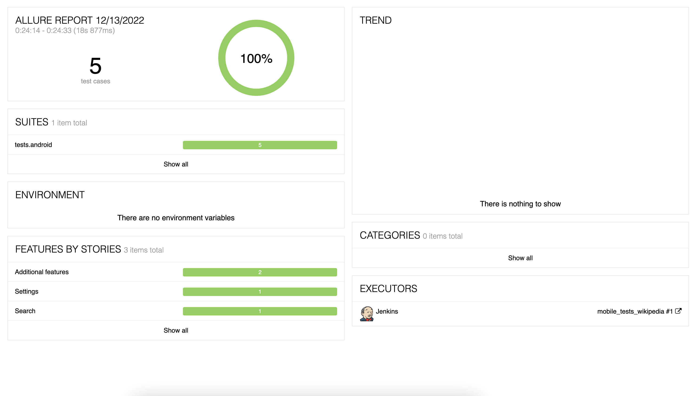
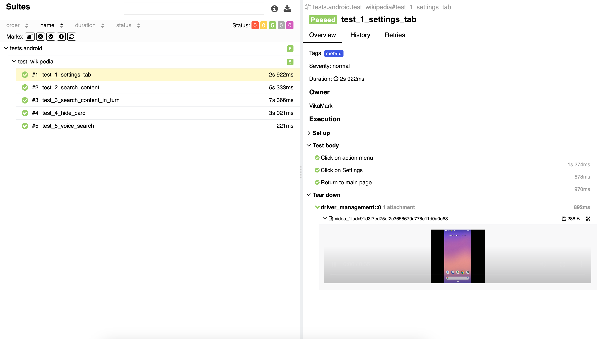
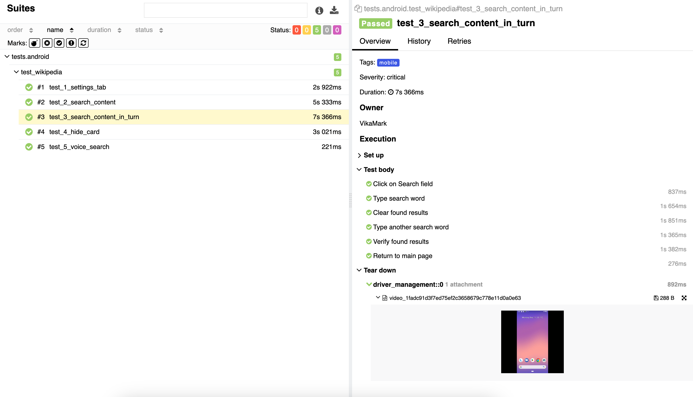
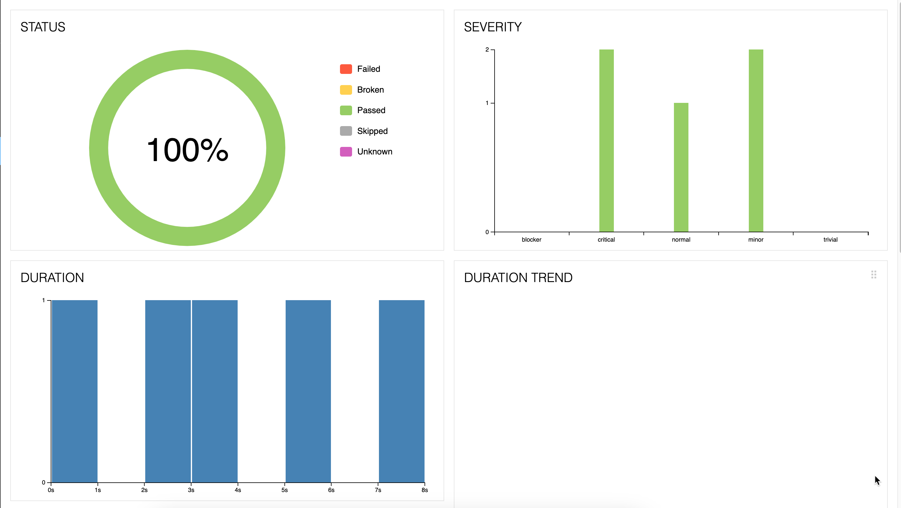
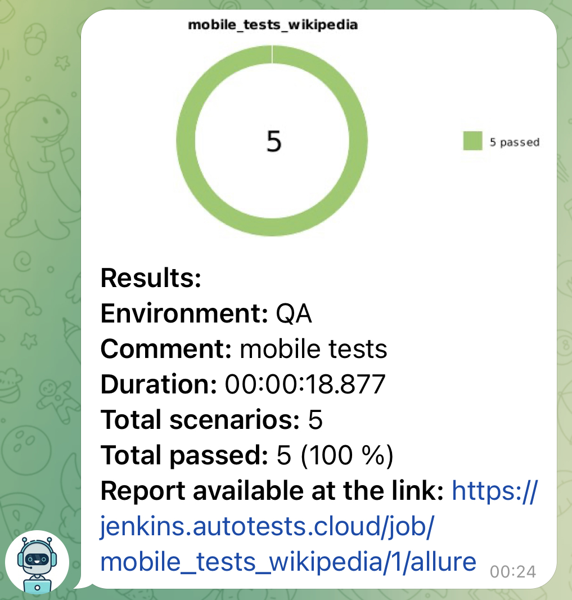

# Autotests Project on "Wikipedia" mobile app testing
> <a target="_blank" href="https://www.wikipedia.org/">Link to the site</a>

## The project is implemented with the use of the following technologies:

#### List of verifications executed in mobile autotests:
- [x] Settings tab displaying
- [x] Search results displaying
- [x] Search results displaying (consecutive requests)
- [x] Hide this card' feature
- [x] Voice search feature displaying

# Autotests were launched on Jenkins server
> <a target="_blank" href="https://jenkins.autotests.cloud/job/mobile_tests_wikipedia/">Link to the project in Jenkins</a>

### Tests launch in Jenkins

# Tests execution results report
> <a target="_blank" href="https://jenkins.autotests.cloud/job/mobile_tests_wikipedia/1/allure/">Link to Allure report</a>

#### Graphs report tab

# Notification with Jenkins build results report is sent automatically to Telegram-bot

